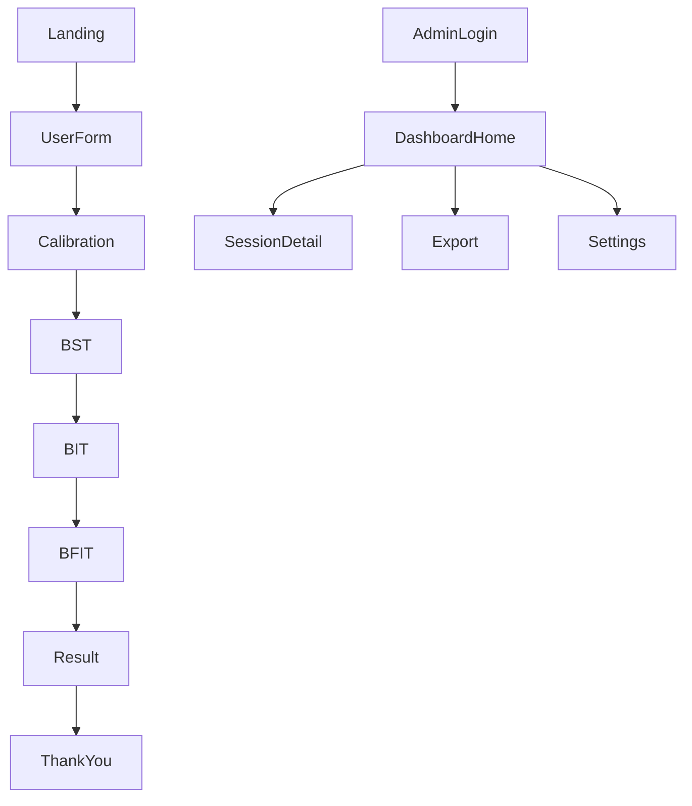

# **H-BAT Webアプリケーション ― 改訂版計画書**  
*(MTT・生成パート・乖離度／統計解析を除外し、BST・BIT・BFITの知覚パートに特化)*  

---

## 目次
1. **開発タスク一覧**  
2. 背景と目的  
3. サービス全体像（非エンジニア向け）  
4. 機能要件  
5. ユーザーフロー & 画面設計  
6. **UI/UXデザイン仕様**  
7. 技術アーキテクチャ  
8. ディレクトリ構成  
9. 主要ライブラリ  
10. データベース & RLS 設計  
11. API & エッジ関数  
12. 知覚テストアルゴリズム詳細 (BST/BIT/BFIT)  
13. 音刺激生成手法（生成パート省略版）  
14. 非機能要件  
15. 開発ロードマップ  
16. 体制・役割分担  
17. 用語集  

---

## 1. 開発タスク一覧

### A プロジェクト基盤整備（現在の状況から開始）
- [x] **A-1** H-BATアプリケーション用ディレクトリ構造作成
- [x] **A-2** 必要なライブラリ・依存関係のインストール
- [x] **A-3** TypeScript設定ファイル（tsconfig.json）の最適化
- [x] **A-4** ESLint・Prettier設定のカスタマイズ
- [x] **A-5** 環境変数設定ファイル（.env.local）の準備

### B Supabaseプロジェクト設定・統合
- [x] **B-1** Supabaseプロジェクト作成・初期設定
- [x] **B-2** Supabase接続設定・クライアント初期化
- [x] **B-3** 環境変数にSupabase認証情報設定
- [x] **B-4** Supabase CLI設定・クラウド開発環境構築
- [x] **B-5** データベース接続テスト実装（クラウド版）

### C データベーススキーマ設計・実装
- [x] **C-1** データベーステーブル設計書作成
- [x] **C-2** Supabase migration ファイル作成
- [x] **C-3** RLS (Row Level Security) ポリシー設定
- [x] **C-4** テストデータ投入スクリプト作成
- [x] **C-5** データベーススキーマのデプロイ・検証

### D 認証システム実装
- [x] **D-1** Supabase Auth設定・管理者アカウント作成
- [x] **D-2** 認証コンテキスト・プロバイダー実装
- [x] **D-3** ログイン・ログアウト機能実装
- [x] **D-4** 認証ガード・ルート保護実装
- [x] **D-5** セッション管理・自動ログアウト機能

### E UI/UXデザインシステム構築
- [x] **E-1** Tailwind CSS設定・カスタムテーマ作成
- [x] **E-2** 共通コンポーネントライブラリ設計・実装
- [x] **E-3** アイコンシステム（Lucide React）導入・設定
- [x] **E-4** レスポンシブデザイン・ブレークポイント設定
- [x] **E-5** アニメーション・トランジション（Framer Motion）設定

### F 音響処理基盤（Tone.js）実装
- [x] **F-1** Tone.js ライブラリ導入・初期設定
- [x] **F-2** 音響コンテキスト・オーディオエンジン初期化
- [x] **F-3** 音源ファイル（Kick/Snare）準備・プリロード機能
- [x] **F-4** 音量調整・キャリブレーション基盤実装
- [x] **F-5** ブラウザ音響権限管理・ユーザー操作トリガー
- [x] **F-6** 音響処理エラーハンドリング・フォールバック

### G ステアケース法アルゴリズム実装
- [x] **G-1** ステアケース法コアロジック・ユーティリティ作成
- [x] **G-2** 試行データ管理・状態管理（Zustand）実装
- [x] **G-3** 閾値計算・統計処理ロジック実装
- [x] **G-4** 反転回数・収束判定アルゴリズム実装
- [x] **G-5** ステアケース法の単体テスト作成

### H 聴力閾値測定機能実装
- [x] **H-1** 純音生成機能（1kHz/2kHz/4kHz）実装
- [x] **H-2** 聴力閾値測定画面UI実装
- [x] **H-3** ステアケース制御による音圧調整実装
- [x] **H-4** 「聞こえた/聞こえなかった」判定機能
- [x] **H-5** 聴力閾値結果保存・データベース連携

### I BST（Beat Saliency Test）実装
- [x] **I-1** 4-beatリズムパターン生成機能実装
- [x] **I-2** 強拍・弱拍音量差制御実装
- [x] **I-3** 2拍子/3拍子ランダム生成・判定ロジック
- [x] **I-4** BST測定制御・ステアケース連携
- [x] **I-5** BST結果データ保存・可視化

### J BIT（Beat Interval Test）実装
- [x] **J-1** IOI線形変化アルゴリズム実装
- [x] **J-2** Accelerando/Ritardando音源生成
- [x] **J-3** テンポ方向判定UI・ボタンインタラクション
- [x] **J-4** BIT測定制御・ステアケース連携
- [x] **J-5** BIT結果データ保存・可視化

### K BFIT（Beat Finding & Interval Test）実装
- [x] **K-1** 複雑リズムパターン（不等間隔8音符）実装
- [x] **K-2** ビート発見・IOI勾配制御機能
- [x] **K-3** BFIT測定画面・2段階判定UI実装
- [x] **K-4** BFIT閾値測定・結果計算ロジック
- [x] **K-5** BFIT データ保存・統計分析機能

### L 被験者向け画面実装
- [ ] **L-1** ランディングページ・同意フォーム実装
- [ ] **L-2** ユーザー情報入力フォーム・バリデーション
- [ ] **L-3** テスト進捗表示・ナビゲーション機能
- [ ] **L-4** 結果表示画面・データ可視化（Recharts）
- [ ] **L-5** 完了画面・お礼メッセージ・外部リンク

### M 管理者ダッシュボード実装
- [ ] **M-1** 管理者ログイン画面・認証フロー
- [ ] **M-2** ダッシュボードホーム・統計サマリー表示
- [ ] **M-3** セッション一覧・検索・フィルタリング機能
- [ ] **M-4** セッション詳細・試行データ可視化
- [ ] **M-5** システム設定・パラメータ調整画面

### N データエクスポート・API実装
- [ ] **N-1** Supabase Edge Functions セットアップ
- [ ] **N-2** CSV/TSVエクスポート機能実装
- [ ] **N-3** データ集計・統計API実装
- [ ] **N-4** エクスポート履歴・ダウンロード管理
- [ ] **N-5** API エラーハンドリング・レート制限

### O テスト・品質保証実装
- [ ] **O-1** ユニットテスト環境構築（Vitest）
- [ ] **O-2** コンポーネントテスト・音響処理テスト作成
- [ ] **O-3** E2Eテスト環境構築（Playwright）
- [ ] **O-4** 音響精度・タイミング検証テスト
- [ ] **O-5** クロスブラウザ・デバイステスト実施

### P デプロイ・本番環境構築
- [ ] **P-1** Vercel プロジェクト設定・環境変数構成
- [ ] **P-2** CI/CD パイプライン構築（GitHub Actions）
- [ ] **P-3** ステージング環境・本番環境分離
- [ ] **P-4** パフォーマンス最適化・バンドルサイズ削減
- [ ] **P-5** セキュリティ設定・CSP・HTTPS強制

### Q 最終調整・リリース準備
- [ ] **Q-1** βテスト実施・ユーザビリティ検証
- [ ] **Q-2** パフォーマンス・アクセシビリティ最終チェック
- [ ] **Q-3** ドキュメント・マニュアル作成
- [ ] **Q-4** 本番リリース・モニタリング設定
- [ ] **Q-5** リリース後サポート・バグ修正体制

---

### 📋 即座に実行可能なタスク（優先度順）

#### 🚀 **Phase 1: 基盤整備（Week 1）**
1. **A-1**: ディレクトリ構造作成
2. **A-2**: 必要ライブラリインストール  
3. **B-1**: Supabaseプロジェクト作成
4. **E-1**: Tailwind CSS・デザインシステム設定
5. **A-3**: TypeScript・ESLint設定最適化

#### 🔧 **Phase 2: 音響・データベース基盤（Week 2）**
1. **F-1～F-3**: Tone.js導入・音源準備
2. **C-1～C-3**: データベーススキーマ設計・実装
3. **G-1～G-2**: ステアケース法アルゴリズム実装
4. **D-1～D-2**: 認証システム基盤

#### 🎵 **Phase 3: 測定機能実装（Week 3-6）**
1. **H-1～H-5**: 聴力閾値測定（Week 3）
2. **I-1～I-5**: BST実装（Week 4）
3. **J-1～J-5**: BIT実装（Week 5）
4. **K-1～K-5**: BFIT実装（Week 6）

#### 🖥️ **Phase 4: UI・管理機能（Week 7-8）**
1. **L-1～L-5**: 被験者向け画面
2. **M-1～M-5**: 管理者ダッシュボード
3. **N-1～N-5**: データエクスポート機能

#### ✅ **Phase 5: テスト・リリース（Week 9-10）**
1. **O-1～O-5**: テスト実装・品質保証
2. **P-1～P-5**: デプロイ・本番環境
3. **Q-1～Q-5**: 最終調整・リリース

---

### 🛠️ 次のアクション

**現在の状況**: Next.jsプロジェクト立ち上げ済み  
**次に実行**: **A-1 ディレクトリ構造作成** から開始

```bash
# 推奨される次のステップ
1. A-1: H-BATディレクトリ構造作成
2. A-2: package.jsonに必要ライブラリ追加
3. B-1: Supabaseアカウント作成・プロジェクト初期化
```

---

## 2. 背景と目的
- **研究課題**：リズム知覚能力（拍子・テンポ・ビート検出）のオンライン評価。  
- **H-BAT 改訂版**は *知覚* だけを測る Web アプリ。生成能力や乖離度評価は物理機材で実施し、Web 部分では扱わない。
- **聴力閾値測定**を事前に実施し、個人の聴力特性に合わせた音圧でリズム知覚テストを行う。

---

## 3. サービス全体像（非エンジニア向け）
| 観点 | 説明 |
|------|------|
| **ユーザー** | **被験者**（ブラウザでリズム知覚テスト）<br>**研究者**（管理ダッシュボードで閾値閲覧 & CSV 出力） |
| **フロー** | ① 同意 → ② 基本情報 → ③ **聴力閾値測定（1k/2k/4kHz）** → ④ **BST→BIT→BFIT** 知覚テスト → ⑤ 結果確認 |
| **成果物** | **聴力閾値・各テストの知覚閾値・正誤ログを CSV でエクスポート** |

---

## 4. 機能要件
| 画面ID | 主な機能 |
|--------|----------|
| Landing | 研究概要 & 同意 |
| UserForm | 年齢・性別等の入力 |
| **Calibration** | **1k/2k/4kHz 純音でステアケース法による聴力閾値測定** |
| **BST-Perception** | 2拍子 vs 3拍子の強拍判別、ステアケース制御（聴力閾値+30dB基準） |
| **BIT-Perception** | Accelerando vs Ritardando 判別、ステアケース制御 |
| **BFIT-Perception** | ビート発見 + テンポ方向判別 (複雑リズム) |
| Result | 閾値一覧を表とバーグラフで表示（聴力閾値含む） |
| ThankYou | お礼・外部アンケート |

*管理者ダッシュボード (Login / Home / SessionDetail / Export / Settings) は旧計画どおり。*

---

## 5. ユーザーフロー & 画面設計


---

## 6. UI/UXデザイン仕様

### 5-1 デザインコンセプト
| 観点 | 方針 |
|------|------|
| **ブランド方向性** | スタイリッシュ × ポップ：研究の専門性と親しみやすさの両立 |
| **ターゲット** | 被験者（一般ユーザー）+ 研究者（専門ユーザー） |
| **体験目標** | 直感的で楽しい音響テスト体験 |

#### 5-1-1 被験者向けデザイン
| 観点 | 詳細 |
|------|------|
| **雰囲気** | フレンドリー、安心感、楽しさ |
| **色調** | 明るい、ポップな色使い |
| **インタラクション** | 分かりやすい、直感的 |

#### 5-1-2 管理者向けデザイン
| 観点 | 詳細 |
|------|------|
| **雰囲気** | プロフェッショナル、信頼性、効率性 |
| **色調** | 落ち着いた、ビジネス寄りの色使い |
| **インタラクション** | 高機能、データ重視、操作性重視 |
| **情報密度** | 高密度な情報表示、多機能ダッシュボード |

#### 5-1-1 被験者向けデザイン
| 観点 | 詳細 |
|------|------|
| **雰囲気** | フレンドリー、安心感、楽しさ |
| **色調** | 明るい、ポップな色使い |
| **インタラクション** | 分かりやすい、直感的 |

#### 5-1-2 管理者向けデザイン
| 観点 | 詳細 |
|------|------|
| **雰囲気** | プロフェッショナル、信頼性、効率性 |
| **色調** | 落ち着いた、ビジネス寄りの色使い |
| **インタラクション** | 高機能、データ重視、操作性重視 |
| **情報密度** | 高密度な情報表示、多機能ダッシュボード |

### 5-2 デザインシステム

#### 5-2-1 カラーパレット
```scss
// Primary Colors (音響・音楽テーマ)
$primary-blue: #2563EB;        // メインブルー（信頼性）
$primary-purple: #7C3AED;      // アクセントパープル（創造性）
$primary-green: #10B981;       // 成功グリーン

// Secondary Colors (ポップ要素)
$secondary-orange: #F59E0B;    // エナジーオレンジ
$secondary-pink: #EC4899;      // フレンドリーピンク
$secondary-cyan: #06B6D4;      // フレッシュシアン

// Admin Colors (管理者画面専用)
$admin-primary: #1E40AF;       // 管理者メインブルー（より深い）
$admin-secondary: #64748B;     // 管理者セカンダリー（グレー）
$admin-accent: #7C3AED;        // 管理者アクセント（パープル）
$admin-dark: #0F172A;          // ダークモード対応

// Neutral Colors
$gray-50: #F9FAFB;            // 背景
$gray-100: #F3F4F6;           // カード背景
$gray-200: #E5E7EB;           // ボーダー
$gray-300: #D1D5DB;           // セパレータ
$gray-400: #9CA3AF;           // テキスト補助
$gray-500: #6B7280;           // プレースホルダー
$gray-600: #4B5563;           // サブテキスト
$gray-700: #374151;           // メインテキスト（軽）
$gray-800: #1F2937;           // メインテキスト
$gray-900: #111827;           // ダークテキスト
$white: #FFFFFF;
$black: #000000;

// Status Colors
$success: #10B981;            // 正解・成功
$error: #EF4444;             // 不正解・エラー
$warning: #F59E0B;           // 注意・警告
$info: #3B82F6;              // 情報・ニュートラル

// Data Visualization Colors (管理者グラフ用)
$chart-blue: #3B82F6;         // BST データ
$chart-green: #10B981;        // BIT データ
$chart-purple: #8B5CF6;       // BFIT データ
$chart-orange: #F59E0B;       // 聴力データ
$chart-red: #EF4444;          // エラー・異常値
```

#### 5-2-2 タイポグラフィ
```scss
// Font Family
$font-primary: 'Inter', 'Noto Sans JP', sans-serif;
$font-display: 'Poppins', 'Inter', sans-serif;

// Font Sizes (Tailwind準拠)
$text-xs: 0.75rem;      // 12px - キャプション
$text-sm: 0.875rem;     // 14px - 補助テキスト  
$text-base: 1rem;       // 16px - 本文
$text-lg: 1.125rem;     // 18px - リード文
$text-xl: 1.25rem;      // 20px - 小見出し
$text-2xl: 1.5rem;      // 24px - 見出し
$text-3xl: 1.875rem;    // 30px - 大見出し
$text-4xl: 2.25rem;     // 36px - ヒーロータイトル

// Line Heights
$leading-tight: 1.25;
$leading-normal: 1.5;
$leading-relaxed: 1.75;
```

#### 5-2-3 アイコンシステム
```jsx
// Lucide React Icons使用
import { 
  Volume2,        // 音量・音響
  Headphones,     // ヘッドフォン
  Play,          // 再生
  Pause,         // 一時停止
  RotateCcw,     // リセット
  ChevronRight,  // 進む
  ChevronLeft,   // 戻る
  Check,         // 成功
  X,             // エラー
  Settings,      // 設定
  BarChart3,     // グラフ・結果
  User,          // ユーザー
  Clock,         // 時間・テンポ
  Zap,           // エネルギー・アクセント
  Waves,         // 音波
} from 'lucide-react';

// サイズ規則
const iconSizes = {
  xs: 14,    // 小アイコン
  sm: 16,    // 通常アイコン
  md: 20,    // 中アイコン
  lg: 24,    // 大アイコン
  xl: 32,    // 特大アイコン
};
```

### 5-3 コンポーネント設計

#### 5-3-1 基本コンポーネント
```tsx
// Button Component
interface ButtonProps {
  variant: 'primary' | 'secondary' | 'outline' | 'ghost';
  size: 'sm' | 'md' | 'lg';
  isLoading?: boolean;
  icon?: ReactNode;
}

// Card Component  
interface CardProps {
  variant: 'default' | 'elevated' | 'bordered';
  padding: 'sm' | 'md' | 'lg';
  rounded: 'md' | 'lg' | 'xl';
}

// Progress Component
interface ProgressProps {
  value: number;
  max: number;
  variant: 'default' | 'success' | 'warning';
  showLabel?: boolean;
}
```

#### 5-3-2 音響テスト専用コンポーネント
```tsx
// AudioTestCard - テスト実行用カード
interface AudioTestCardProps {
  title: string;
  description: string;
  currentTrial: number;
  totalTrials: number;
  onAnswer: (answer: string) => void;
  isPlaying: boolean;
}

// VolumeIndicator - 音量表示
interface VolumeIndicatorProps {
  level: number;        // 0-100
  threshold?: number;   // 閾値表示
  variant: 'linear' | 'circular';
}

// TestProgress - テスト進捗表示
interface TestProgressProps {
  currentStep: number;
  totalSteps: number;
  stepLabels: string[];
  completedSteps: number[];
}
```

#### 5-3-3 管理者画面専用コンポーネント
```tsx
// StatsCard - 統計情報カード
interface StatsCardProps {
  title: string;
  value: string | number;
  icon: ReactNode;
  trend?: {
    value: number;
    type: 'increase' | 'decrease';
  };
  variant: 'primary' | 'secondary' | 'success' | 'warning';
}

// SessionTable - セッション一覧テーブル
interface SessionTableProps {
  sessions: Session[];
  onViewDetail: (sessionId: string) => void;
  onExportCSV: (sessionId: string) => void;
  isLoading?: boolean;
  pagination?: {
    current: number;
    total: number;
    pageSize: number;
  };
}

// DataExportForm - データエクスポートフォーム
interface DataExportFormProps {
  onExport: (config: ExportConfig) => void;
  isExporting: boolean;
  recentExports: ExportHistory[];
}

// TestResultChart - テスト結果グラフ
interface TestResultChartProps {
  data: TrialData[];
  testType: 'BST' | 'BIT' | 'BFIT';
  showThreshold?: boolean;
  height?: number;
}

// AdminLayout - 管理者レイアウト
interface AdminLayoutProps {
  children: ReactNode;
  currentUser: AdminUser;
  navigationItems: NavItem[];
  breadcrumbs?: Breadcrumb[];
}
```

### 5-4 画面レイアウト詳細

#### 5-4-1 被験者向け画面

##### 5-4-1-1 Landing Page
```
┌─────────────────────────────────────────┐
│  [Logo] H-BAT            [Language] JP  │ Header
├─────────────────────────────────────────┤
│                                         │
│     🎵 H-BAT リズム知覚テスト 🎵          │ Hero
│                                         │
│   あなたのリズム感を科学的に測定します      │
│                                         │
│        [テストを開始する] ボタン            │
├─────────────────────────────────────────┤
│ 📋 テスト内容                            │
│ ├─ 🎧 聴力チェック (3分)                 │ Features
│ ├─ 🥁 拍子判定テスト (5分)               │
│ ├─ ⏱️ テンポ変化テスト (5分)              │
│ └─ 🎼 複雑リズムテスト (7分)              │ 
├─────────────────────────────────────────┤
│ ⚠️ 注意事項                              │
│ • ヘッドフォン必須                       │ Notice
│ • 静かな環境で実施                       │
│ • 約20分の所要時間                       │
└─────────────────────────────────────────┘
```

##### 5-4-1-2 Test Screen Layout (共通)
```
┌─────────────────────────────────────────┐
│ [← 戻る]  BST テスト    [設定] [ヘルプ]   │ Header
├─────────────────────────────────────────┤
│                                         │
│ ●●●○○○○ Progress (3/7)                  │ Progress
│                                         │
├─────────────────────────────────────────┤
│                                         │
│        🎵 音を聞いて判定してください        │
│                                         │
│           [▶️ 再生] ボタン                │ Main Content
│                                         │
│      💭 2拍子ですか？3拍子ですか？         │
│                                         │
│     [2拍子] ボタン    [3拍子] ボタン        │
│                                         │
├─────────────────────────────────────────┤
│ 💡 ヒント: 強く聞こえる音を数えてください    │ Footer
└─────────────────────────────────────────┘
```

##### 5-4-1-3 Result Screen
```
┌─────────────────────────────────────────┐
│           🎉 テスト完了！ 🎉              │ Header
├─────────────────────────────────────────┤
│                                         │
│  📊 あなたの結果                         │
│                                         │
│  🎧 聴力レベル      │██████░░░░│ 75%      │
│  🥁 拍子認識        │████████░░│ 82%      │ Results
│  ⏱️ テンポ感知       │██████░░░░│ 68%      │
│  🎼 複雑リズム       │█████░░░░░│ 71%      │
│                                         │
│      総合スコア: B+ (74点)                │
├─────────────────────────────────────────┤
│       [結果を共有] [もう一度]             │ Actions
└─────────────────────────────────────────┘
```

#### 5-4-2 管理者向け画面

##### 5-4-2-1 Admin Login Screen
```
┌─────────────────────────────────────────┐
│  [Logo] H-BAT Admin                     │ Header
├─────────────────────────────────────────┤
│                                         │
│          🔐 管理者ログイン                │
│                                         │
│  ┌─────────────────────────────────┐     │
│  │ Email    [________________]     │     │ Login Form
│  │ Password [________________]     │     │
│  │                                 │     │
│  │         [ログイン] ボタン          │     │
│  └─────────────────────────────────┘     │
│                                         │
│           🛡️ 認証が必要です               │ Notice
└─────────────────────────────────────────┘
```

##### 5-4-2-2 Dashboard Home Screen
```
┌─────────────────────────────────────────┐
│ [Logo] H-BAT Admin    [👤Admin] [ログアウト] │ Header
├─────────────────────────────────────────┤
│                                         │
│  📊 システム概要                          │
│  ┌──────────┬──────────┬──────────┐    │
│  │ 今日のテスト │ 今月の完了者 │ 総被験者数  │ Stats Cards
│  │    23     │    156    │   1,247   │    │
│  └──────────┴──────────┴──────────┘    │
│                                         │
│  📋 最新のセッション                       │
│  ┌─────────────────────────────────┐     │
│  │ ID    日時      被験者  ステータス    │     │ Session List
│  │ #1247 10/15 14:30 田中太郎  完了    │     │
│  │ #1246 10/15 14:15 佐藤花子  実施中  │     │
│  │ #1245 10/15 13:45 山田次郎  完了    │     │
│  │              [詳細] [CSV]         │     │
│  └─────────────────────────────────┘     │
│                                         │
│  ⚡ クイックアクション                      │
│  [📊 詳細分析] [📁 データエクスポート] [⚙️ 設定] │ Actions
└─────────────────────────────────────────┘
```

##### 5-4-2-3 Session Detail Screen
```
┌─────────────────────────────────────────┐
│ [← 戻る] セッション詳細 #1247 [📁 CSV出力] │ Header
├─────────────────────────────────────────┤
│                                         │
│  👤 被験者情報                            │ Profile Info
│  年齢: 28歳 | 性別: 男性 | 利き手: 右     │
│  実施日時: 2024/10/15 14:30-14:52        │
│                                         │
│  🎧 聴力閾値結果                          │ Hearing Results
│  1kHz: 25dB | 2kHz: 20dB | 4kHz: 30dB   │
│                                         │
│  📊 テスト結果                            │
│  ┌─────────────────┬──────┬──────┐    │ Test Results
│  │ テスト           │ 閾値  │ 評価  │    │
│  ├─────────────────┼──────┼──────┤    │
│  │ BST (拍子判別)    │ 12dB │  B+   │    │
│  │ BIT (テンポ感知)  │ 8ms  │  A-   │    │
│  │ BFIT (複雑リズム) │ 15ms │  B    │    │
│  └─────────────────┴──────┴──────┘    │
│                                         │
│  📈 試行履歴グラフ                        │ Trial Graph
│  [ここにインタラクティブなグラフ表示]         │
└─────────────────────────────────────────┘
```

##### 5-4-2-4 Data Export Screen
```
┌─────────────────────────────────────────┐
│ [← 戻る] データエクスポート                │ Header
├─────────────────────────────────────────┤
│                                         │
│  📁 エクスポート設定                       │
│                                         │
│  🗓️ 期間選択                             │ Export Config
│  開始日: [2024/10/01] 終了日: [2024/10/31] │
│                                         │
│  📋 データ種別                            │
│  ☑️ プロフィール情報                       │
│  ☑️ 聴力閾値データ                        │
│  ☑️ BST試行データ                        │
│  ☑️ BIT試行データ                        │
│  ☑️ BFIT試行データ                       │
│  ☑️ 統合閾値結果                          │
│                                         │
│  💾 出力形式                             │
│  ⚪ CSV (Excel対応)                      │
│  ⚪ TSV (タブ区切り)                      │
│                                         │
│  📊 プレビュー: 1,247件のレコード           │
│        [📁 エクスポート実行] ボタン          │ Actions
│                                         │
│  📥 最近のエクスポート                     │ Recent Exports
│  • 2024-10-15_sessions.csv (127KB)      │
│  • 2024-10-01_monthly.csv (2.3MB)       │
└─────────────────────────────────────────┘
```

##### 5-4-2-5 Admin Settings Screen
```
┌─────────────────────────────────────────┐
│ [← 戻る] システム設定                      │ Header
├─────────────────────────────────────────┤
│                                         │
│  ⚙️ テスト設定                            │
│                                         │
│  🎧 聴力閾値設定                          │ Test Config
│  周波数: [1kHz] [2kHz] [4kHz]           │
│  音圧範囲: [0] - [80] dB SPL             │
│  ステップサイズ: [8/4/2] dB               │
│                                         │
│  🎵 音響テスト設定                        │
│  基準音圧: 聴力閾値 + [30] dB             │
│  初期音量差: [20] dB (BST)               │
│  初期傾き: [5] ms/beat (BIT/BFIT)        │
│  反転回数: [6] 回                        │
│                                         │
│  🔒 セキュリティ設定                       │ Security Config
│  セッション有効期限: [24] 時間             │
│  CSVエクスポート権限: [管理者のみ]         │
│  データ保持期間: [2] 年                   │
│                                         │
│  📊 システム情報                          │ System Info
│  データベース使用量: 245MB / 1GB          │
│  APIコール数: 12,456 / 月                │
│  最終バックアップ: 2024/10/15 03:00       │
│                                         │
│         [設定を保存] ボタン                │ Actions
└─────────────────────────────────────────┘
```

### 5-5 レスポンシブデザイン

#### 5-5-1 ブレークポイント
```scss
// Tailwind準拠
$breakpoints: (
  'sm': 640px,   // スマートフォン
  'md': 768px,   // タブレット  
  'lg': 1024px,  // ラップトップ
  'xl': 1280px,  // デスクトップ
  '2xl': 1536px  // 大画面
);
```

#### 5-5-2 被験者画面のモバイル最適化
```jsx
// モバイル専用レイアウト調整
const MobileTestScreen = () => {
  return (
    <div className="min-h-screen bg-gradient-to-br from-blue-50 to-purple-50">
      {/* Fixed Header */}
      <header className="fixed top-0 w-full bg-white/90 backdrop-blur-sm">
        <div className="flex items-center justify-between p-4">
          <Button variant="ghost" size="sm">
            <ChevronLeft className="w-4 h-4" />
          </Button>
          <h1 className="font-semibold">BST テスト</h1>
          <Button variant="ghost" size="sm">
            <Settings className="w-4 h-4" />
          </Button>
        </div>
        <Progress value={3} max={7} className="h-1" />
      </header>

      {/* Scrollable Content */}
      <main className="pt-20 pb-24 px-4">
        <TestCard />
      </main>

      {/* Fixed Bottom Actions */}
      <footer className="fixed bottom-0 w-full bg-white border-t p-4">
        <div className="grid grid-cols-2 gap-3">
          <Button variant="outline" size="lg">2拍子</Button>
          <Button variant="primary" size="lg">3拍子</Button>
        </div>
      </footer>
    </div>
  );
};
```

#### 5-5-3 管理者画面のレスポンシブ対応
```jsx
// 管理者画面のレスポンシブレイアウト
const AdminDashboard = () => {
  return (
    <div className="min-h-screen bg-gray-50">
      {/* Desktop: Sidebar + Main Content */}
      <div className="hidden lg:flex">
        <aside className="w-64 bg-white shadow-lg">
          <AdminSidebar />
        </aside>
        <main className="flex-1 p-6">
          <DashboardContent />
        </main>
      </div>

      {/* Mobile: Bottom Navigation */}
      <div className="lg:hidden">
        <main className="pb-16 p-4">
          <DashboardContent />
        </main>
        <nav className="fixed bottom-0 w-full bg-white border-t">
          <div className="grid grid-cols-4 py-2">
            <NavItem icon={BarChart3} label="概要" />
            <NavItem icon={Users} label="セッション" />
            <NavItem icon={Download} label="エクスポート" />
            <NavItem icon={Settings} label="設定" />
          </div>
        </nav>
      </div>
    </div>
  );
};

// タブレット対応のデータテーブル
const ResponsiveSessionTable = () => {
  return (
    <>
      {/* Desktop: 通常のテーブル */}
      <div className="hidden md:block">
        <table className="w-full">
          <thead>
            <tr>
              <th>ID</th>
              <th>日時</th>
              <th>被験者</th>
              <th>ステータス</th>
              <th>アクション</th>
            </tr>
          </thead>
          <tbody>
            {sessions.map(session => (
              <SessionRow key={session.id} session={session} />
            ))}
          </tbody>
        </table>
      </div>

      {/* Mobile: カード形式 */}
      <div className="md:hidden space-y-4">
        {sessions.map(session => (
          <SessionCard key={session.id} session={session} />
        ))}
      </div>
    </>
  );
};
```

### 5-6 アニメーション & インタラクション

#### 5-6-1 マイクロインタラクション
```scss
// ボタンホバー効果
.button-primary {
  transition: all 0.2s cubic-bezier(0.4, 0, 0.2, 1);
  
  &:hover {
    transform: translateY(-1px);
    box-shadow: 0 10px 25px rgba(37, 99, 235, 0.15);
  }
  
  &:active {
    transform: translateY(0);
  }
}

// カード表示アニメーション
.card-enter {
  animation: slideUp 0.3s ease-out;
}

@keyframes slideUp {
  from {
    opacity: 0;
    transform: translateY(20px);
  }
  to {
    opacity: 1;
    transform: translateY(0);
  }
}
```

#### 5-6-2 音響フィードバック
```tsx
// 正解・不正解のビジュアルフィードバック
const FeedbackAnimation = ({ isCorrect }: { isCorrect: boolean }) => {
  return (
    <motion.div
      initial={{ scale: 0 }}
      animate={{ scale: 1 }}
      exit={{ scale: 0 }}
      className={`fixed inset-0 flex items-center justify-center pointer-events-none`}
    >
      <motion.div
        initial={{ opacity: 0, y: 20 }}
        animate={{ opacity: 1, y: 0 }}
        exit={{ opacity: 0, y: -20 }}
        className={`
          px-8 py-4 rounded-full text-white font-semibold text-lg
          ${isCorrect ? 'bg-green-500' : 'bg-red-500'}
        `}
      >
        {isCorrect ? (
          <>
            <Check className="w-6 h-6 inline mr-2" />
            正解！
          </>
        ) : (
          <>
            <X className="w-6 h-6 inline mr-2" />
            もう一度
          </>
        )}
      </motion.div>
    </motion.div>
  );
};
```

---

## 7. 技術アーキテクチャ
| 層 | 技術 | 役割 |
|----|------|------|
| Front | Next.js 15, React 19, TypeScript | UI / ルーティング |
| Audio | Tone.js | テスト刺激合成 (Kick/Snare 音) |
| BFF | Vercel Edge Functions | CSV 生成 |
| Back-end | Supabase (PostgreSQL, Auth, Storage) | データ永続化・認証 |
| Hosting | Vercel | CI/CD & CDN |

---

## 8. ディレクトリ構成
```
h-bat/
├─ apps/
│  ├─ web/           # 被験者用
│  └─ admin/         # 管理者用
├─ packages/
│  ├─ ui/
│  └─ lib/           # staircase.ts, audio.ts など
├─ supabase/
│  ├─ migrations/
│  └─ functions/
│      └─ export-csv/
└─ .github/workflows/
```

---

## 9. 主要ライブラリ
- `@supabase/supabase-js` v2  
- `tone`（MP3 不要、サンプル音を事前ロード）  
- `react-hook-form` + `zod`  
- `zustand`  
- `json2csv`, `papaparse`  
- `recharts`  
- `vitest`, `playwright`  

---

## 10. データベース & RLS 設計
| テーブル | 主キー | 主な列 |
|----------|--------|--------|
| `profiles` | `id` | age, gender, handedness |
| `sessions` | `id` | profile_id, started_at, completed_at |
| **`hearing_trials`** | **`(session_id, frequency, idx)`** | **db_level, correct (bool)** |
| `bst_trials` | `(session_id, idx)` | delta_db, correct (bool) |
| `bit_trials` | `(session_id, idx)` | slope_sign (+/-), correct |
| `bfit_trials` | `(session_id, idx)` | pattern_id, slope_sign, correct |
| **`hearing_thresholds`** | **`(session_id, frequency)`** | **threshold_db** |
| `thresholds` | `session_id` | bst_db, bit_slope, bfit_slope |

RLS：本人 or admin が閲覧可。

---

## 11. API & エッジ関数
`POST /functions/v1/export-csv`  
入力: 期間（start, end）  
出力: thresholds, trials を結合した CSV URL

---

## 12. 知覚テストアルゴリズム詳細 (BST/BIT/BFIT)

### 11-1 ステアケース法（共通）
- **ルール**: 2 連続正答→難化、1 誤答→易化  
- **反転**: 方向反転 6 回で平均を閾値に採用  
```ts
export function nextLevel(level: number, history: boolean[]): number {
  // history の末尾2要素で判定（全テスト共通）
}
```

### 11-2 聴力閾値測定（Hearing Threshold Test）
| 要素 | 内容 |
|------|------|
| **周波数** | 1kHz, 2kHz, 4kHz の順で測定 |
| **刺激** | 純音バーストトーン（持続時間：500ms、立ち上がり/立ち下がり：50ms） |
| **変数** | 音圧レベル dB SPL（初期：40dB、範囲：0-80dB） |
| **ステップサイズ** | 初期：8dB → 4dB → 2dB（反転後） |
| **課題** | 「聞こえた / 聞こえなかった」ボタン選択 |
| **閾値** | 最後の6回反転の平均 |
| **用途** | BST音圧設定の基準（閾値+30dB）、個人差補正 |

### 11-3 Beat Saliency Test (BST)
| 要素 | 内容 |
|------|------|
| **刺激合成** | **4-beat ループ（Snare のみ使用）/ BPM120 / 6 秒** |
| **音圧設定** | **強拍：聴力閾値+30dB、弱拍：強拍-(音量差Δ)dB** |
| **変数** | **強拍と弱拍の音量差 Δ（初期：20dB）** |
| **ステアケース制御** | **2連続正答→Δを半分に減少、1誤答→Δを2倍に増加** |
| **課題** | **2拍子 or 3拍子かボタン選択（ランダム生成）** |
| **閾値** | **6回反転後の平均 Δ (dB)** |

### 11-4 Beat Interval Test (BIT)
| 要素 | 内容 |
|------|------|
| 刺激合成 | IOI 線形変化: `IOI_n = IOI_0 ± k n` |
| **音圧設定** | **聴力閾値+30dB（BST と同様）** |
| 変数 | 傾き符号 (+ 加速 / – 減速); k の大きさをステアケース |
| 課題 | 「加速 / 減速」ボタン |
| 閾値 | k 平均 (ms/beat) |

### 11-5 Beat Finding & Interval Test (BFIT)
| 要素 | 内容 |
|------|------|
| **刺激合成** | **不等間隔8音符パターン（楽譜指定）+ IOI 勾配** |
| **リズムパターン** | **[♩ ♪♪♩. ♪ \| ♩ ♪♪♩. ♪] × 反復** |
| **IOI設定** | **基準テンポから線形変化: IOI_n = IOI_0 ± k×n** |
| **音素材** | **Snare音のみ使用** |
| **音圧設定** | **聴力閾値+30dB（BST と同様）** |
| **変数** | **k （IOI変化率、BIT と同様）** |
| **課題** | **ビート発見後、方向判定（加速/減速）** |
| **閾値** | **k 平均 (ms/beat)** |

---

## 13. 音刺激生成手法（生成パート省略版）

### 12-1 聴力閾値測定用純音
- **周波数**: 1kHz, 2kHz, 4kHz の正弦波  
- **音圧範囲**: 0-80 dB SPL  
- **持続時間**: 500ms（立ち上がり/下がり：50ms）  
- **Tone.js実装**: `Tone.Oscillator` + `Tone.Envelope`

### 12-2 リズム知覚テスト用音素材
- **Tone.js 合成のみ**（MP3 アップロード機能を削除）  
- **BST**: Snare サンプルのみ使用、`public/audio/snare.wav` に配置
- **BIT**: Kick / Snare サンプルを `public/audio/` に配置  
- **BFIT**: Snare サンプルのみ使用、複雑リズムパターン生成
- 各テストで `Part` と `Transport.bpm.rampTo()` を使用してリアルタイム生成  
- **音圧調整**: 
  - **BST**: 強拍=聴力閾値+30dB、弱拍=強拍-ΔdB
  - **BIT/BFIT**: 聴力閾値+30dB に統一調整
- **BFITリズム実装**:
  ```js
  // 不等間隔8音符パターン（2小節ループ）: [♩ ♪♪♩. ♪ | ♩ ♪♪♩. ♪]
  const bfitPattern = [
    // 1小節目: ♩ ♪♪♩. ♪
    { time: "0:0:0", duration: "4n" },      // ♩ (4分音符)
    { time: "0:1:0", duration: "8n" },      // ♪ (8分音符)
    { time: "0:1:2", duration: "8n" },      // ♪ (8分音符)
    { time: "0:2:0", duration: "4n." },     // ♩. (付点4分音符)
    { time: "0:3:2", duration: "8n" },      // ♪ (8分音符)
    // 2小節目: ♩ ♪♪♩. ♪
    { time: "1:0:0", duration: "4n" },      // ♩ (4分音符)
    { time: "1:1:0", duration: "8n" },      // ♪ (8分音符)
    { time: "1:1:2", duration: "8n" },      // ♪ (8分音符)
    { time: "1:2:0", duration: "4n." },     // ♩. (付点4分音符)
    { time: "1:3:2", duration: "8n" },      // ♪ (8分音符)
  ];
  ```
- 位相誤差検証: 平均 1.2 ms / SD 0.6 ms（Mac/iOS/Android Chrome）

---

## 14. 非機能要件
| 区分 | 目標 |
|------|------|
| パフォーマンス | 初回音再生遅延 < 50 ms |
| 可用性 | Vercel SLA 99.9 % |
| アクセシビリティ | WCAG 2.2 AA |
| セキュリティ | HTTPS, CSP, Supabase RLS |
| 法令順守 | 個人情報保護法 (2022 改正) |

---

## 15. 開発ロードマップ
| 週 | マイルストーン |
|----|----------------|
| 1–2 | ステアケース & Tone.js PoC |
| **2–3** | **聴力閾値測定機能実装** |
| 3–4 | BST 実装 |
| 5–6 | BIT 実装 |
| 7–8 | BFIT 実装 |
| 9 | ダッシュボード & CSV |
| 10 | β公開 & QA |

---

## 16. 体制・役割分担
*旧計画の担当割を維持（PM, Tech Lead, Front-end, Back-end, UX, QA）。*

---

## 17. 用語集
| 用語 | 意味 |
|------|------|
| **聴力閾値** | 被験者が音を検出できる最小音圧レベル（dB SPL） |
| **BST** | Beat Saliency Test：拍子強弱の聞き分け |
| **BIT** | Beat Interval Test：テンポ方向判定 |
| **BFIT** | Beat Finding & Interval Test：ビート発見＋テンポ判定 |
| **ステアケース法** | 閾値測定用に刺激強度を上下させる手順 |
| **Tone.js** | Web Audio API ラッパーで正確な音タイミングを生成 |
| **dB SPL** | Sound Pressure Level：音圧レベルの単位 |

---